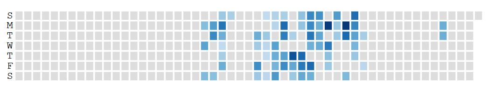
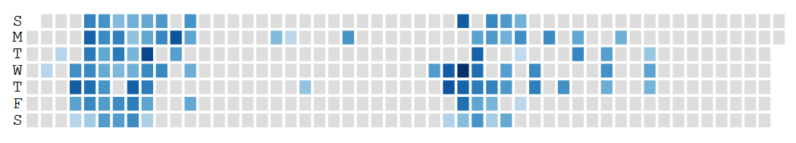
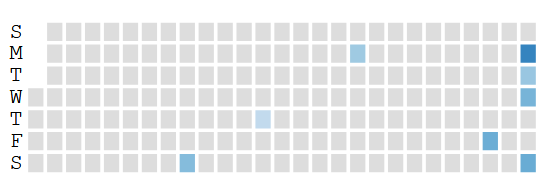
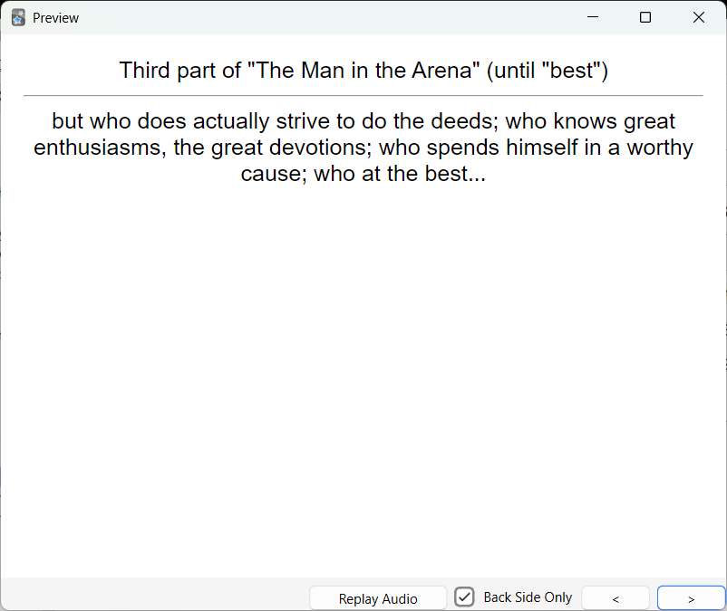

+++
title = "How has Anki benefitted me so far?"
date = 2025-07-05T00:00:00Z
draft = false
author = "Pat"
description = """Reflecting on what I have gained from using Anki sporadically \
for two years, and thinking about how I want to use it now"""
tags = []
categories = []
images = []

# set X (formerly known as Twitter) card image

# set slug if you want to change a page
slug = ""

# modify type of page (posts show up on front page)
# types can be found in mainSections
type = "post"

# if you want to display modification date
# lastmod = 2024-03-01T00:00:00Z

# redirect old URLs to new URL for post
aliases = []

# SEO keywords
keywords = ["anki", "benefits", "improvement", "srs"]

# if post is part of a blog series
series = []

# if you want to weight a particular post's ranking
# weight = 1

# generate table of contents
toc = false
+++

I have been using [Anki](https://ankiweb.net/about), the spaced repetition tool,
off and on for two years now. For context, here are my usage graphs:    

<i>2023</i>

<i>2024</i>

<i>2025</i>

As you can see, I'm much more inactive than active. Aside from summers and a new
year's resolution in 2024, I haven't been consistent in my memory
practice. I started using Anki because many people I follow on the Internet used
it. I had several reference sheets lying around from finals, and decided to add
information from those as cards to start.

I want to reevaludate how I use Anki as I start back up. My goals have changed,
and I want to use my previous experiences to inform how to effectively use
spaced repetition.

### Successes

I have had several moments where investing the time in Anki have visibly paid
off, usually in classes where retaining material was important. There have also
been less visible successes, but here's a list of things I know mainly because
of Anki.
- I memorized density and mass functions of probability distributions, and
  expected values, variances, and connections between them. This helped when
  recalling distribtuions in advanced statistics classes.
- I memorized two poems, *Jabberwocky* and *Ozymandias*
- The first summer, I understood terminology from a theory of computation course
  after adding it in the first week.
- Learned preprocessor directives in C, some Makefile syntax, and random trivia
  about `<stdio.h>`.
- Thanks to a few random prompts from one of the reference sheets, I knew about
  the six types of files (regular files (`-`), `d`irectories, symbolic `l`inks,
  named `p`ipes, `c`haracter devices, and `b`lock special devices) in Unix
  before encountering them in a systems programming course last spring.

### Failures

However, not all cards are created equal. Some notable failures that come to
mind from the first two years include:
- I created cards to memorize facts about LEDs and LCDs when breadboarding, but
  all of those cards are leeches now.
- The vocabulary questions from the theory of computation class no longer fit
  outside of the context of the class, and the cards don't stand up alone.
- I memorized the poems above, but didn't spend time sitting with them the way
  Michael Nielsed did when [memorizing various text
  passages](https://michaelnotebook.com/memorize/index.html), which has led to
  brittle memory, no understanding, and difficulty memorizing trickier passages.
- I memorized other probability distributions and facts [without understanding
  them](/2025/07/02/lognormal), breaking the cardinal rule of spaced repetition:
  understand before you learn.

### Analyzing a bad prompt

As I start to weed out my deck, I want to be mindful and intentional about how I
use Anki. Each card I suspend or flag is an opportunity to reflect on why I
created that card, what I don't like about it now, and how to avoid creating
cards like it in the future.

Often, my cards have poor prompts. I have observerd several mistakes I made when
first writing prompts: the questions assume but don't provide context, the
answers are too detailed, or too vague (what is a correct answer?), there's only
one card for a topic that should have several. Andy Matuschak has [an exstensive
guide](https://andymatuschak.org/prompts/) on how to write better memory
prompts. He lists five properties of effective retrieval prompts: **focused**,
**precise**, **consistent**, **tractable**, and **effortful**.

Here's an example of a bad card I want to assess:

Evaluating based on the qualities above, what's wrong with this card?
- This answer is not **focused**. The response is over twenty words, more than
  double the length of the question, and I am expecting myself to recall it
  verbatim. Additionally, it relies on details outside the scope of what I want
  to recall.
- The prompt is not **precise**. Instead of providing context for the passage,
  the card implies context about how I broke up the sections when first writing
  cards. It includes nothing specific about the passage itself (doing deeds, the
  great devotions, etc.). Rather, it asks for the "third" part of the passage,
  an arbitrary distinction I made before memorizing, and relies on me
  remembering enough of the passage to know where the "best" keyword is.
- As a result of the lack of precision, the prompt is not **tractable**. When I
  came back to this card after ten months, I couldn't remember if the "third
  part" referred to the end of the poem or this section. My brain lit up in
  reference to the poem, but not the specific lines I wanted to recall here.
- The card is not very **tractable**, as adding it felt like relearning this
  specific passage.

If the card is so bad, why does it exist at all? Prior to *The Man in the
Arena*, I had previous success memorizing *Ozymandias* by breaking the poem up
according to its narrative structure: setting the desert scene, the sculptor's
description, and the rise and fall of the king. I tried to apply a similar
tactic to this passage, and the semicolons make for great cutoffs.

However, I failed to take into account how different this passage is. There is a
narrative structure, but it is less aparent, and I didn't take the time to
understand it before creating structure-based cards. I also failed to appreciate
how complex the passage was, and didn't make enough cards in general for it.

Another general thing I struggle with is evolving my deck. Once I've created a
card, it can feel like it's etched in stone. Rewriting or discarding a card
feels like cheating: instead of recognizing a tool that's not working, I'm
cheating on a personal test, changing the answers to fit my style. I fail to
realize what my purpose is when using Anki. I am trying to build knowledge, not
to evaluate it. If I am consistently getting a card incorrect, it is far better
to modify or discard it than to memorize brittle knowledge, or get discouraged
from getting many questions wrong and become inconsistent.

### Lessons to apply going forward

Now that I've looked at this card, how will I avoid creating similar cards going
forward?

1. Spend some time understanding this passage. I'll sit down with a pencil,
   noting word choices that are interesting, surface details, orderings of
   clauses, and learning about the context of the speech.
2. Create (more, better) cards. Now that I have a framework to evaluate previous
   prompts around, I'll create atomic, specific notes (and more of them).
3. Delete previous cards. I won't be afraid to change what isn't working,
   suspend and reevaluate cards, and modify the ones I create now.
4. Get more creative in what kinds of cards I use. Instead of solely recall, I
   can add images, cards to prompt me to think, opinion-based cards that I can
   reflect on and modify. I've stuck to the prompt-then-regurgitate mold for too
   long now.
   
One of my goals this summer is to memorize *The Rime of The Ancient Mariner*. It
is considerably longer than anything I've tried before, and will benefit from my
experience with smaller passages.

I also want to add cards to help me learn more quickly at work. This will take
more time and thought, but evaluating what I've done so far is a first step in
that direction.
