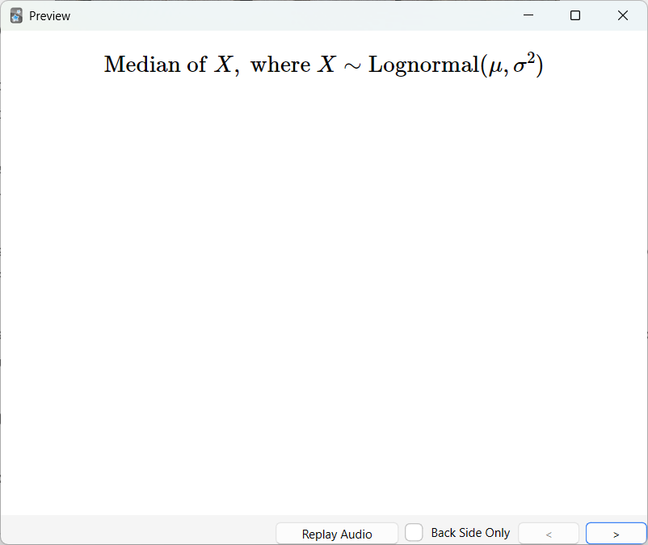

+++
title = "The lognormal distribution"
date = 2025-07-02T00:00:00Z
draft = false
author = "Pat"
description = "Learning what I do not understand"
tags = []
categories = []
images = []

# set X (formerly known as Twitter) card image

# set slug if you want to change a page
slug = ""

# modify type of page (posts show up on front page)
# types can be found in mainSections
type = "post"

# if you want to display modification date
# lastmod = 2024-03-01T00:00:00Z

# redirect old URLs to new URL for post
aliases = []

# SEO keywords
keywords = ["anki", "probability", "lognormal"]

# if post is part of a blog series
series = []

# if you want to weight a particular post's ranking
# weight = 1

# generate table of contents
toc = false
+++

I have an Anki deck that I've sporadically built over the past two years. It
contains cards ranging from Bash commands, to stanzas from Jabberwocky, to
questions about using spaced repetition itself. I've used it successfully to
understand Unix and some CS concepts, but haven't been intentional about my
memory practice habits. I've heard the success stories of others, but as with
the gym, I am not consistent.

In an effort to change that fact, I've been spending time with my [now-"angry"
Anki deck](https://x.com/andy_matuschak/status/1843014366976688450)[^1]
recently. As a result, I'm finding cards that are so bad that I don't know how
to answer them (how *do* you create cards for sets vs. enumerations?  why did I
decide to memorize this vague answer?).

When it comes to my probabilty cards, however, I can feel myself falling into
the classic trap. According to Piotr Wozniak, the [first rule of spaced
repetition](https://www.supermemo.com/en/blog/twenty-rules-of-formulating-knowledge)
is
> Do not learn if you do not understand.

While I did spend some time in probability and statistics classes, I don't
understand every probability distribution I've added to my deck.

So when this card popped up, I didn't know where to start.[^2]

Some things I remind myself of whenever I get a card with the word "lognormal"
in it:
- When you take the log of a random variable from this distribution, you obtain
  a random variable that is normally distributed.
  $$
  X \sim \text{Lognormal}(\mu, \sigma^2) \rightarrow \ln(X) = Y \sim N(\mu, \sigma^2)
  $$
- Lognormal random variables cannot be negative.
- Francis Galton
- ...

This blog post is an attempt to get some intuition on the lognormal
distribution.

### Where does this distribution come from?

Francis Galton studied many naturally occuring phenomena. He got upset when
others would measure errors and not take into account that error is not
necessarily evenly spaced out. He [gave the
example](https://galton.org/essays/1870-1879/galton-1879-geometric-mean.pdf) of
tinting: say you have white scattered on a black background in quantities of $1,
2, 4, 8, ...$ These appear to the eye to be equally spaced apart. If someone
were to be given a tint of size $4$, they could miss either on the dark side
($2$) or the light side ($8$).

Galton pointed out that the arithmetic mean $\left(\frac{2+8}{2} = 5\right)$ was
not the correct way of thinking about this situation: rather, one should use the
*geometric* mean $\left(\sqrt{2*8} = 4\right)$, as the effect of one degree
lighter (or darker) was multiplicative, not additive.

What if one took the log of all of these tints? You would end up back with
quanitites ($0, 1, 2, 3, ...$) where the effect of moving a deviation would be
additive again.

Similar to the arithmetic and geometric means in the error above, the normal and
lognormal distributions represent the relationship between *additive* and
*multiplicative* effects. In the normal distribution, the mean $\mu$ is a
location parameter. Increasing or decreasing the parameter just shifts the
distribution along the $x$-axis. In the lognormal distribution, $e^{\mu}$ is a
scaling parameter. Here, increasing $\mu$ changes the
[shape](https://gist.github.com/yuki-koyama/675fbc373e399c00378e593f46985e78) of
the scale of the distribution, not just shifting its center.

### What is its density function?

Let $X \sim N(\mu, \sigma^2)$. The probability density function (pdf) of the
normal distribution is
$$
\large \Phi(x) = \frac{1}{\sigma\sqrt{2\pi}} \exp\left[-\frac12\left(\frac{x-\mu}{\sigma}\right)^2\right]
$$

Let $Y = e^X$. Then we have $X = \ln(Y)$. It is not immediately intuitive how to
derive the lognormal distribution from this information: if you swap $x$ with
$ln(y)$, you don't obtain the correct distribution. Linear transformations are
much more straightforward: adding by $C$ or multiplying by $D$ has effects on
the distribution that one can derive from their expected value and variance.

The textbook I'm reading doesn't help with this either. Lawless in "Statistical
Models And Methods For Lifetime Data" (p. 24):

> and from this p.d.f of $\\;T=\exp{Y}$ is easily found to be ...

However, if I remembered from probability classes of yore (last year) before
looking this up, one can convert between the disribution function (CDF) and
density function by integrating, using the desired random variable as the upper
bound. The derivation [performed
here](https://gregorygundersen.com/blog/2023/12/17/lognormal/#a3-probability-density-function)
by Gregory Gundersen gives us

$$
\large f_Y(y) = \frac{1}{y\\; \sigma \sqrt{2\pi}} \exp\left\[ -\frac{1}{2}\left(\frac{\ln
y - \mu}{\sigma} \right)^2 \right\]
$$

### How can you get the median from this?

This I [also had to look
up](https://statproofbook.github.io/P/lognorm-med.html). I won't try to derive
it now, so I'm left with two options:
- spend the holiday deriving this
- remove it from my Anki deck

Time will tell which I choose.

[^1]: Full text of the tweet from Andy Matuschak:

    *A friend asks: after a hiatus of a few months, how to apologize to an Anki*
    *deck? It feels "angry" now! I wrote:*

    *I totally get you. Here's the thing: the Anki deck has been mistreated—but*
    *not by you!*

    *The Anki designers accidentally put the wrong clothes on the poor Anki*
    *deck. They dressed it up as an inbox. When you don't attend to an inbox,*
    *it just keeps piling higher and higher.*

    *But I think the Anki deck wants to be treated more like meditation, or a*
    *nourishing meal. If you miss a week of meditation sessions, you don't*
    *meditate 8 times as long next time. If you fast for a few days, you don't*
    *find yourself wanting to consume 4,000 calories in your next meal.*

    *Concretely, I suggest: try setting the maximum cards/day to 50 (at a*
    *typical average of 6s/card, this is 5m). When you finish, you're done!*
    *You did your meditation session and/or ate your nourishing meal! If you*
    *want to do another later that day, that's fine; you can do that if you*
    *want.*

    *Unless your deck is enormous, if you do 50/day (~5m), you'll catch up*
    *eventually. Really, it's totally fine if it takes weeks! It's just the*
    *hyperliteral Anki interface that makes it feel not fine.*

    *Also: taking a break actually gives you an opportunity. You have fresh*
    p*erspective on your deck. Probably now it's easier to sense that you don't*
    *care about a bunch of those cards. So, give yourself the freedom—or,*
    *better, encouragement!—to suspend/delete any cards that stimulate a*
    *disinterested response.*

[^2]: I added these to the deck from a formula sheet from a statistics class in
    university. We never had to learn anything about the lognormal distribution,
    just know that it existed.
