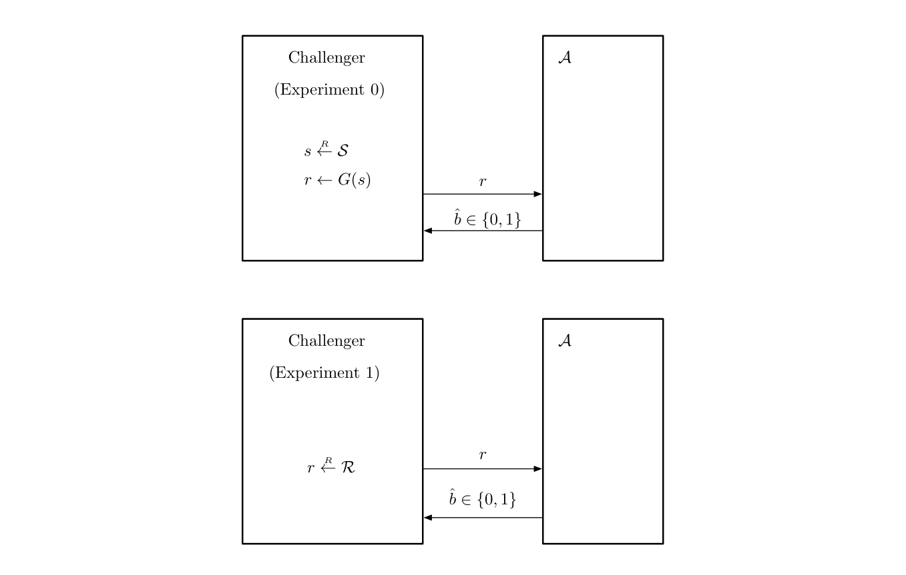

+++
title = "Understanding LWE: the learning with errors problem"
date = 2024-09-16T00:00:00Z
draft = false
author = "Pat"
description = "Examining a computational hardness assumption in cryptography"
tags = ["cryptography", "lwe", "complexity"]
categories = []
images = []

# set slug if you want to change a page
slug = ""

# modify type of page (posts show up on front page)
# types can be found in mainSections
type = "post"

# if you want to display modification date
# lastmod = 2024-03-01T00:00:00Z

# redirect old URLs to new URL for post
aliases = []

# SEO keywords
keywords = ["cryptography", "learning with errors", "linear equations",
"complexity", "theory", "lwe"]

# if post is part of a blog series
series = []

# if you want to weight a particular post's ranking
# weight = 1

# generate table of contents
toc = false
+++

Cryptographic protocols that perform computations on encrypted data without
decrypting it are known as homomorphic encryption. [Fully homomorphic
encryption](https://en.wikipedia.org/wiki/Homomorphic_encryption#Fully_homomorphic_encryption)
(FHE) protocols, systems which support arbitrary computations, often rely on
different primitives than conventional cryptography systems. Most FHE systems in
practice used lattice-based cryptography, relying on a computational hardness
assumption known as the learning with errors (LWE) problem.

## Cryptograhy relies on assumptions
Prior to the 20th century, cryptography did not rely on a formalized system of
provable security. Rather, one set of people (cryptographers) would come up with
clever ciphers, and another set of people (cryptanalysts) would attempt to break
those ciphers. Encryption schemes such as the Caesar cipher, the Vingenère
cipher, the Enigma, and other systems were not formally proven secure by
cryptographers. Rather, they relied on obfuscation and statistical properties
that made deciphering messages fairly difficult. However, each one of these
systems had some sort of flaw that cryptanalysts were able to exploit to
decipher encrypted messages. [^1]

Modern cryptography, starting in the 1970s and 80s, changed the way we define
security to be about adversarial *capabilities* rather than
*strategies*. Instead of attempting to figure out the many ways a potential
adversary could attack a specific protocol, cryptographers base security
protocols on well-studied problems for which no known solution exists. The
fundamental assumption that much of cryptography rests on is that $P \neq NP$.

Why is this a bedrock assumption for many protocols? The definitions that
cryptography uses today all come from security games, where an arbitrary
distinguisher (the adversary) tries to figure out what the challenger (the
protocol) is doing. For example, in the adversarial game below, the adversary
$\mathcal{A}$ is trying to distinguish whether the challenger is providing it
with either a pseudorandom bit string (Experiment 0) or a completely random
string (Experiment 1).

<figure>

<figcaption><em>Pseudorandom generator (PRG) adversarial game. Source:
"A Graduate Course in Applied Cryptography", Boneh and Shoup</em></figcaption>
</figure>

The question of whether an adversary can distinguish between two games (or
experiments, or scenarios) is a question that belongs to the complexity class
NP. It can be verified by a deterministic machine (the algorithm used to create
whatever artifact is being tested, e.g. a pseudorandom generator or encryption
algorithm) and can be solved by a nondeterministic Turing machine. However, if
there exists a deterministic Turing machine that can solve this question of
distinguishability, then no cryptographic protocol relying on this model is
secure.

This presents a benefit to cryptographers in both cases: either protocols that
rely on this assumption are secure, or we will have an incredible breakthrough
in mathematics.

### Other assumptions

However, to build specific protocols, we often require more assumptions than
this. The first two assumptions used to build secure protocols, the discrete log
problem and the factoring problem, come from number theory.

**Discrete Log**

The discrete logarithm problem typically used in cryptography can be expressed
as follows. Let $p$ be a prime number, and take the group $\mathbb{Z}\_p^\*$,
the multiplicative group of numbers modulo $p$. Let $g \in \mathbb{Z}\_p^\*$ be
a generator of the group $\mathbb{Z}\_p^\*$. Since $g$ is a generator, we can
raise $g$ to the power of any element in $\mathbb{Z}\_p^\*$ and get a unique
element from $\mathbb{Z}\_p^\*$ - a bijection.

Now, randomly select an element $x$ from $\mathbb{Z}\_p^\*$ and calculate $g^x =
t$. The discrete log question is: given $t$, can you calculate $x$? The
assumption that is relevant to cryptography is that it is computationally hard
to find $x$ given $t$. [^2] This assumption can be generalized to other groups
outside of multiplicative modular integer sets, such as elliptic curve groups
that are widely used today.

The first public protocol to use the discrete log assumption was Diffie-Hellman
key exchange. Others, such as ElGamal and Schnorr, were developed using this
assumption as their basis, and many systems today (DSA, TLS, SSH, PGP, Tor) have
some form of the discrete log assumption guaranteeing their security.

**Factoring and the RSA assumption**

Suppose we have a number $N$ and two primes $p$ and $q$ such that $N = pq$. The
factoring assumption states that given $N$, it is computationally hard to obtain
$p$ and $q$.  Intuitively, factoring a large composite number into two slightly
less large primes appears to be a difficult problem. The fastest known factoring
algorithm on a current computer is the general number field sieve (GNFS), which
runs in sub-exponential time (not poly time).

The RSA assumption is slightly different: we take our numbers from before ($N$,
$p$, and $q$) and select at random an exponent $e$ from
$\mathbb{Z}\_{\varphi(N)}$, where $\varphi(N) = (p-1)(q-1)$ is Euler's
totient function on $N$. We then select $x$ from $\mathbb{Z}\_{N}^\*$ and
compute $y = x^e$. The RSA assumption states that given $N, y$ and $e$, it is
computationally hard to determine $x$. This assumption comes directly from the
RSA protocol itself. [^3]

## Lattice-based cryptography

In 1994, Peter Shor invented a quantum algorithm (known as [Shor's
algorithm](https://en.wikipedia.org/wiki/Shor's_algorithm)) that is able to find
the prime factors of an integer. The paper also states a similar algorithm that
is able to compute discrete logs. This algorithm runs in polynomial time on a
quantum computer, meaning that all protocols based on either the discrete log or
the integer factoring assumptions are not secure against quantum computers.

Over the resulting decades, cryptographers have taken into account this new
threat and started looking for computational hardness assumptions that would be
resistant to quantum algorithms. One of the places where they looked was lattice
theory.

### Lattices

Lattice theory is at the intersection of abstract algebra and order
theory. Formally, a **lattice** is defined as a partially ordered set in which
each two-element subset has both a least upper bound and a greatest lower
bound. [^4] Lattices in $\mathbb{R}^n$ are a subset of this definition. They can
be thought of what results from a [change of
basis](https://eli.thegreenplace.net/2015/change-of-basis-in-linear-algebra/) in
linear algebra. If you take all integer combinations of a basis for
$\mathbb{R}^n$, you will then have a lattice.

<figure>

<figcaption><em>A lattice in $\mathbb{R}^2$. Note that vectors between any
two points do not necessarily define the lattice. Source: Wikimedia</em></figcaption>
</figure>

While there are many interesting properties of lattices, a question relevant to
computer science is whether there are problems that are computationally hard to
perform. Such a computation would provide security against adversaries, who
would be unable to perform such a computation given restrictions on their
computational power.

The **shortest vector problem** is one such question. The problem is: given a
basis $B$ of a lattice $L$ (the vector space $V$), what is the shortest non-zero
vector, as measured by its Euclidean norm $||\mathbf{v}||\_2$? [^5] In other
words: suppose I give you a set of vectors $\mathbf{v}\_1, \mathbf{v}\_2, ...,
\mathbf{v}\_n$. These form a basis for some vector space (a lattice): you can
take integer linear combinations (for example, $2\mathbf{v}\_1 +
5\mathbf{v}\_2 + ...$) of them to obtain infinitely many points in the
space. How would you find the shortest possible vector $\mathbf{v}$ in that
space, such that $||\mathbf{v}||\_2 = \underset{\mathbf{v} \in L \smallsetminus
{0}}{\min} ||\mathbf{v}||_2$?

<figure>

<figcaption><em>An illustration of the shortest vector problem for a lattice in
$\mathbb{R}^2$. Source: Wikimedia</em></figcaption>
</figure>

SVP is known to be NP-hard for randomized reductions. [^6] Other questions, such
as the gap shortest vector problem (GapSVP), shortest independent vector problem
(SIVP), closest vector problem (CVP), and more also exist and provide
computational hardness in different ways.

### Computational hardness of lattice problems

One important property of lattice problems that makes them useful in
cryptography is that their worst-case computational hardness is often equal to
their average-case hardness. Proofs of this began with Ajtai's papers in 1994
and 1996 on generating hard instances of lattice problems and the computational
hardness of SVP. [^7]

Worst-case computational hardness refers to how difficult it is to compute a
problem in the worst case possible. However, cryptography relies on average-case
hardness. Each use of a cryptographic system must be difficult, not just the
worst case of that system. These systems often rely on randomness to generate
specific instances of a protocol (e.g., generate keys to use for encryption),
and randomness pertains to a randomly selected, i.e. average case.

Equivalence between worst-case and average-case problems is crucial for
lattice-based cryptography. It means that given a single instance of a
lattice problem that is hard to solve, we can generate many equally hard
instances of that problem. This allows for stronger guarantees around
computational hardness in a variety of cases involving randomization.

## LWE

One way to measure the usefulness of an assumption is by its complexity. The
shortest vector problem is one such instance: it is simple to state, and fairly
easy to understand. However, this is not the only measure of an assumption: one
can also look at how long the problem has remained unsolved for, how much effort
has been expended trying to solve it, and how useful or practical it is. SVP is
useful across most of these metrics, but another problem has proven more
flexible when designing new systems and protocols.

The **learning with errors** problem (LWE) can be stated somewhat precisely as
follows. Fix a size parameter $n \geq 1$, a modulus $q \geq 2$, and an error
probability distribution $\chi$ on $\mathbb{Z}\_q$, the integers modulo $q$. We
can define $A\_{\mathbf{s}, \chi} \in \mathbb{Z}\_q^n \times \mathbb{Z}\_q$ as
the probability distribution that is obtained by choosing a vecor $\mathbf{a} \in
\mathbb{Z}\_q^n$ uniformly at random, choosing $e$ in $\mathbb{Z}\_q$ based on
its probability distribution $\chi$, and computing the tuple $(\mathbf{a},
\langle \mathbf{a}, \mathbf{s} \rangle + e)$. Now: given $n, q, \chi$, and an
arbitrary number of samples from the distribution $A\_{\mathbf{s}, \chi}$, what
is $\mathbf{s}$.

To convert this to an adversarial game (and a distinguishability problem), we
can express the vectors $\mathbf{a}\_1 ... \mathbf{a}\_n$ as a matrix $A$, and
have a challenger select either a random vector $\mathbf{r}
\stackrel{R}{\leftarrow} \mathbb{Z}\_q^n$ and compute $A\mathbf{r}$, or select a
secret $\mathbf{s}$ and an error vector $\mathbf{e} \leftarrow \mathbb{Z}\_q^n$
based on $\chi$, and compute $A\mathbf{s} + \mathbf{e}$. The problem in this form
is to distinguish between these two games, and the assumption is that they are
computationally indistinugashable.

$$
\begin{aligned}
A\mathbf{s} + \mathbf{e} \approx A\mathbf{r} \\
\end{aligned}
$$

The two paragraphs above may not make much sense at first, so let's look at an
example. This specific example was taken from a survey paper, "The Learning with
Errors Problem", by Oded Regev, the person who first came up with LWE (and later
won the Gödel prize).

### An example of learning with errors

First, we fix our parameters. For this example, $n = 4$ and $q = 17$. One way to
think about "an arbitrary number of samples" from $A\_{\mathbf{s}, \chi}$ is as
a system of equations. In each equation, we will have 4 variables $(n = 4)$, all
expressed modulo $17$. The coefficients of each variable can be expressed by the
vector $\mathbf{a}$, whose entries we select uniformly at random from
$\mathbb{Z}\_q$. Let us forget about the error term $e$ for the moment and focus
on the problem at hand.

Let's sample $\mathbf{a} \hspace{0.25em} 6$ times, multiply it by the secret
vector $\mathbf{s}$, and look at its result (the second element of the tuple
given to us, denoted here as $c\_i$). We might expect something like the
following:

$$ \begin{aligned}
14s\_1 + 15s\_2 + 5s\_3 + 2s\_4 &= c\_1 \\: (\text{mod} \\; 17) \\\
13s\_1 + 14s\_2 + 14s\_3 + 6s\_4 &= c\_2 \\: (\text{mod} \\; 17)  \\\
6s\_1 + 10s\_2 + 13s\_3 + 1s\_4 &= c\_3 \\: (\text{mod} \\; 17)  \\\
10s\_1 + 4s\_2 + 12s\_3 + 16s\_4 &= c\_4 \\: (\text{mod} \\; 17)  \\\
9s\_1 + 5s\_2 + 9s\_3 + 6s\_4 &= c\_5 \\: (\text{mod} \\; 17)  \\\
3s\_1 + 6s\_2 + 4s\_3 + 5s\_4 &= c\_6 \\: (\text{mod} \\; 17)  \\\
\end{aligned} $$

How would you solve for $\mathbf{s}$, given the vector $\mathbf{c}$? The
straightforward approach is to use Gaussian elimination. The brilliance of LWE,
and what makes it computationally hard, is the error term $e$ for each
equation.

Recall the second term of our tuple: $\langle \mathbf{a}, \mathbf{s} \rangle +
e$. Suppose now that, instead of just presenting $c\_1 ... c\_6$, I instead
added an error term to each equation, where $e\_i \stackrel{R}{\leftarrow}
\\{-1, 0, 1\\}$ uniformly at random:

$$ \begin{aligned}
14s\_1 + 15s\_2 + 5s\_3 + 2s\_4 &= 8  &&(\text{mod} \\; 17) \\\
13s\_1 + 14s\_2 + 14s\_3 + 6s\_4 &= 16 &&(\text{mod} \\; 17)  \\\
6s\_1 + 10s\_2 + 13s\_3 + 1s\_4 &= 3 &&(\text{mod} \\; 17)  \\\
10s\_1 + 4s\_2 + 12s\_3 + 16s\_4 &= 12 &&(\text{mod} \\; 17)  \\\
9s\_1 + 5s\_2 + 9s\_3 + 6s\_4 &= 9 &&(\text{mod} \\; 17)  \\\
3s\_1 + 6s\_2 + 4s\_3 + 5s\_4 &= 16 &&(\text{mod} \\; 17)  \\\
\end{aligned} $$

We might try our first approach: Gaussian elimination. However, consider that
each of our equations now has some error to it. The first equation could be
$8$... or $7$... or $9$. We don't know for cerain. If we guess the error term
incorrectly (here, the probability of this is $\frac{2}{3}$), we're in trouble -
our error will compound throughout each equation. Since we have only 4 variables
to solve for, we can limit this by taking the first four equations, but the
probability that we are correct with every error term $e\_i$ that  we choose is
$(1 - \frac{2}{3})^4$, and thus the probability that we are wrong somewhere is
$1 - (1 - \frac{2}{3})^4 = \frac{80}{81}$. [^8]

This is the trickiness of the learning with *errors* problem - the errors in
each term compound as we solve for $\mathbf{s}$, and they compound
exponenetially. The best known algorithms for LWE run in exponential time, and
there is evidence to suggest that quantum algorithms and tricks will not help to
solve this problem - in some cases, they might increase the complexity. [^9]

### Computational hardness

Regev [Reg05] and Chris Peikert [Pei09] established the hardness of the learning
with errors problem by connecting it with two of the problems mentioned (but not
described) above: GapSVP and SIVP. The core of Regev's proof is a connection
between LWE and SIVP: that is, given oracle access to solutions of the learning
with errors problem, one is able to solve a worst-case lattice problem that we
only know how to solve in exponential time. This problem can be stated as
follows (from [Reg05]):

*Let $q \geq 2$ be an integer and $\alpha$ be a real number in $(0, 1)$. Assume
we are given access to an oracle that solves the $\text{LWE}$ problem with
modulus $q$ and error parameter $\alpha$. Then, given as input any lattice
$\Lambda$, a large enough polynomial number of samples from the discrete
Gaussian distribution $D\_{\Lambda^\*, r}$, for some (not too small) $r$, and a
point $\mathbf{x}$ witin distance $\alpha q / (\sqrt{2r})$ of $\Lambda$, we can
output the (unique) closest lattice point $\mathbf{x}$ in polynomial time.*

Note that the radius does not depend on $n$ but only on $q$, $\alpha$, and
$r$. This solves the lattice problem BDD (bounded distance decoding), another
lattice problem focused on decoding a lattice. [^10] This problem can be stated
in terms of GapSVP, as Peikert showed in 2009. Regev, in his original proof,
combined the proposition above with a quantum procedure (creating a periodic
Gaussian distribution) to reduce the problem to the shortest independent vector
problem (SIVP) and GapSVP.

### Related problems

The learning with errors problem is very versatile, but computationally
expensive. The size of the matrix $A$ required for the protocol is on the order
of $n^2$, as you need at least that many vectors to decode $\mathbf{s}$, and
often has $m > n$ columns (a short, fat matrix). It is much more desirable to
have key sizes on the order of $O(n)$, as it makes practical usage of a
cryptographic protocol easier.

**Ring-LWE** allows us to replace the group $\mathbb{Z}\_q^n$ with the ring
$\mathbb{Z}\_q[x] / \langle x^n + 1 \rangle$. The idea is to assume structure in
the LWE samples ($A$) provided, and to condense this representation. We assume
$n$ is a power of two and select the first vector of $A$ $\mathbf{a}\_1 = (a\_1,
a\_2, ... a\_n)$ as before, uniformly at random from $\mathbb{Z}\_q^n$. We then
replace the remaining vectors $(\mathbf{a}\_{2} ... \mathbf{a}\_n)$ with
$\mathbf{a}\_i = (\mathbf{a}\_i, ... \mathbf{a}\_n, -\mathbf{a}\_1 ...
-\mathbf{a}_{i-1})$. These permutations give a ring structure, which is why we
must have $n$ as a power of two (to guarantee that we cannot reduce $x^n + 1$
over $\mathbb{Q}$ by factoring it).  These remaining vectors now only require
$O(n)$ storage (we are repeating elements from $a\_1$) and we can speed up
vector operations using the fast Fourier transform. (e.g., convert polynomials
to point-value representation, multiply, and convert back in *O(n* log *n)*
rather than *O(n^2)*).

A dual problem with LWE is known as the **short integer solutions** problem
(SIS). In this lattice problem, we are given vectors $\mathbf{a}\_1,
\mathbf{a}\_2, ...$ selected uniformly at random from $\mathbb{Z}\_q^n$ and have
to determine a "small" linear combination $\mathbf{s} = c\_1 \mathbf{a}\_1 +
c\_2 \mathbf{a}\_2 + ...$ such that $\displaystyle\sum_{i=1}^n \mathbf{a}\_i +
\mathbf{s} = 0$.

### Crypto uses

Though the purpose of this post is primarily to go over the learning with errors
assumption and its computational hardness, it is important to mention some
of the cryptographic protocols based off of it.

**Public key protocols**: Regev encryption [Reg05] was the first to use the LWE
assumption as the basis for a public key cryptography system. It used the random
matrix $A \in \mathbb{Z}\_q^{n\times m}$ and random vector $\mathbf{b} \in
\mathbb{Z}\_q^m$ as its public key and the vector $\mathbf{s} \in
\mathbb{Z}\_q^m$ as its secret key. To encrypt a message $m$,
the protocol goes bit by bit. For a given bit $x$, you select a random vector
$\mathbf{r} \in \mathbb{Z}\_q^n$ and compute $(A\mathbf{r},
\mathbf{b}'\mathbf{r} + x\lfloor \frac{q}{2} \rfloor) = (c\_1, c\_2)$, To
decrypt, calculate $\hat{x} = c\_2 - \mathbf{s}' c\_1$. If closer to $\lfloor
\frac{q}{2} \rfloor$ modulo $q$, output 1, else ouptut 0.

Other public key protocols using LWE (or ring-LWE) include NTRU Prime and SABER.

**FHE protocols**: The first fully homomorphic encryption scheme was created
by Craig Gentry in [his PhD
thesis](https://crypto.stanford.edu/craig/craig-thesis.pdf) from 2009. It was
later improved upon in the [GSW scheme](https://eprint.iacr.org/2013/340), which
simplified the construction of FHE and reduced the growth of noise between
computations.

**NIST standards**: Last month, the National Institute of Standard and
Technology released its [first set of finalized post-quantum
protocols](https://www.nist.gov/news-events/news/2024/08/nist-releases-first-3-finalized-post-quantum-encryption-standards). Two
of the protocols, Kyber and Dilithium, both come from the [Cryptographic Suite
for Algebraic Lattices](https://pq-crystals.org/) (CRYSTALS). Both rely on
variants of the LWE assumption, modular LWE (MLWE).

## Resources

There are many excellent resuoreces online. The primary ones I used in this post
were [Vinod Vaikuntanathan's
notes](https://people.csail.mit.edu/vinodv/CS294/lecturenotes.pdf) on lattices
and [Oded Regev's survey of
LWE](https://cims.nyu.edu/~regev/papers/lwesurvey.pdf). Others included the
various papers cited throughout the post and in the footnotes, as well as
Wikipedia. For foundational crypography concepts, I used Boneh and Shoup's
[*A Graduate Course in Applied Cryptography*](https://toc.cryptobook.us/).
<!--
Resources being used to research this post:

First two: primary, from Vinod, same
https://people.csail.mit.edu/vinodv/CS294/lecturenotes.pdf
https://people.csail.mit.edu/vinodv/CS294/lecture1.pdf

Easier intro from Stanford
https://web.stanford.edu/class/cs354/scribe/lecture14.pdf

Original Regev papers, need to figure out the difference between them
I think the 40-page one is likely superior
https://dl.acm.org/doi/pdf/10.1145/1060590.1060603
https://dl.acm.org/doi/pdf/10.1145/1568318.156832

Others
https://en.wikipedia.org/wiki/Learning_with_errors
-->
[^1]: See Daniel Kahn's excellent book, *The Codebreakers*, for more on the
    history of early ciphers (and the field of cryptography).

[^2]: In case it is unclear, it is assumed that in addition to the number $t$,
    the group $G$ and the generator $g$ are also public information. The deeper
    principle behind this (and modern cryptography more generally) is known as
    [Kerckhoff's
    Principle](https://en.wikipedia.org/wiki/Kerckhoffs's_principle): the
    security of a cryptosystem must lie in the choice of its keys only, and
    everything else (including the algorithm itself) should be considered public
    knowledge. 

[^3]: To learn more about RSA, [read the original
    paper](https://people.csail.mit.edu/rivest/pubs/RSA78.pdf) or consult the
    Internet (or your LLM of choice).

[^4]: This comes from the Encyclopedia of Mathematic's [definition of a
    lattice](https://encyclopediaofmath.org/wiki/Lattice). For more on lattice
    theory, J.B. Nation has very helpful [introductory
    notes](https://math.hawaii.edu/~jb/lat1-6.pdf) to the subject.

[^5]: Here, we will assume use of the Euclidean norm, but note that any norm of
    your choosing will work here.

[^6]: See [this paper](https://dl.acm.org/doi/pdf/10.1145/276698.276705) by
    Ajtai for the proof of this statement, as well as an explanation of the term
    "randomized reduction" in the first section.

[^7]: The above footnote contains the 1996 paper;
    [here](https://dl.acm.org/doi/pdf/10.1145/237814.237838) is a link to his
    paper from 1994. The paper explains how to generate average-case hardness
    from worst-case hardness.

[^8]: In this case, $\mathbf{s} = (0,13,9,11)$

[^9]: See [this
    episode](https://securitycryptographywhatever.com/2023/11/13/lattice-attacks/)
    of the "Security Cryptography Whatever" podcast for an explanation by Martin
    Albrecht about why this might be the case (timestamp: 22:10, go further back
    for context on the algorithms used)

[^10]: For more on BDD and its computational hardness, see [this
    paper](https://web.eecs.umich.edu/~cpeikert/pubs/bdd-hardness.pdf) by
    Bennett and Peikert
